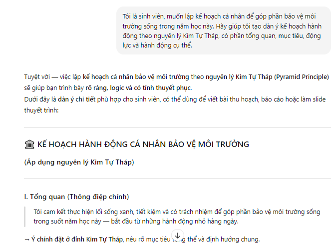
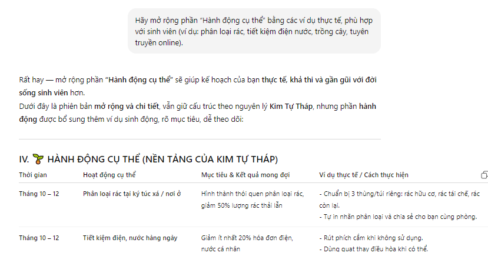
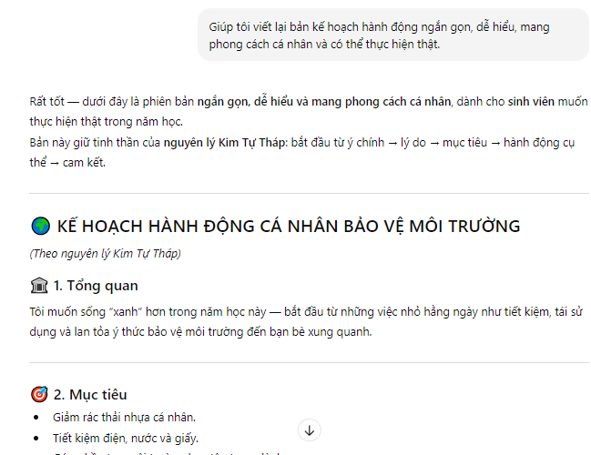

# 🌿 BẢN KẾ HOẠCH HÀNH ĐỘNG CÁ NHÂN – GIỮ GÌN VÀ BẢO VỆ MÔI TRƯỜNG SỐNG

## 🧩 Thông tin sinh viên
- **Họ tên:** Nguyễn Thị Nga  
- **Mã sinh viên:** 0124077010001  
- **Ngành:** Công nghệ thông tin  
- **Lớp quản lý:** D0124HNQTA1  
- **Liên hệ:** nga.nguyen@example.com  

---

## 🪶 1. Mô tả dự án
Dự án **“ActionPlan Environment”** là một **bản kế hoạch hành động cá nhân** giúp sinh viên:
- Nâng cao nhận thức về **bảo vệ môi trường sống** trong đời sống sinh viên.  
- Ứng dụng **AI Chatbot (ChatGPT, Claude, Gemini...)** để lập kế hoạch, tổ chức nội dung theo **nguyên lý Kim Tự Tháp (Pyramid Principle)**.  
- Quản lý toàn bộ tiến trình làm việc trên **GitHub** (repo, commit, README, worklog).

Kết quả là một **bản kế hoạch cá nhân rõ ràng, logic, khả thi và được trình bày theo chuẩn báo cáo chuyên nghiệp**.

---

## ⚙️ 2. Các chức năng của dự án
| STT | Chức năng | Mô tả ngắn |
|-----|------------|------------|
| 1 | **Lập kế hoạch hành động** | Xây dựng kế hoạch 4 phần (Tổng quan, Mục tiêu, Động lực, Hành động). |
| 2 | **Tương tác với AI Chatbot** | Sử dụng prompt để AI gợi ý nội dung và hoàn thiện bản kế hoạch. |
| 3 | **Theo dõi tiến độ (Worklog)** | Ghi lại các bước làm việc, chỉnh sửa và cập nhật phiên bản. |
| 4 | **Quản trị phiên bản GitHub** | Quản lý file, commit, tạo README.md, lưu các prompt và kết quả. |
| 5 | **Tạo minh chứng học tập** | Cung cấp sản phẩm mẫu, log AI, link repo và báo cáo hoàn chỉnh. |

---

## 💻 3. Công nghệ và công cụ sử dụng
| Công nghệ / Công cụ | Vai trò |
|----------------------|----------|
| **ChatGPT (hoặc Claude, Gemini)** | Hỗ trợ tạo nội dung, viết prompt, chỉnh sửa bản kế hoạch. |
| **GitHub** | Lưu trữ phiên bản, tạo README, quản lý lịch sử commit. |
| **Microsoft Word / Google Docs** | Soạn thảo bản kế hoạch hành động chính. |
| **Google Sheets** *(tuỳ chọn)* | Tạo bảng kế hoạch hoặc timeline hành động. |
| **Markdown (.md)** | Viết README chuyên nghiệp cho dự án. |
| **Pyramid Principle** | Cấu trúc logic nội dung: Tổng quan → Chi tiết → Hành động. |

---
## 🤖 4. Cách sử dụng AI ChatBot / AI hỗ trợ (3 prompt + 3 output)
- Prompt 1:

  
- Prompt 2:

  
- Prompt 3:

  

## 🗂️ 5. Cấu trúc thư mục dự án
<pre>
/ActionPlan_Environment_Project
├─ prompts/
│ ├─ output1.txt
│ ├─ output2.txt
│ ├─ output3.txt
│ ├─ prompt1.txt
│ └─ prompt2.txt
│ └─ prompt3.txt
├─ screenshots/
├─ action-plan.docx # File Word nộp bài
├─ readmeActionPlanEnvironment.md
└─ worklog.md  # Nhật ký tiến độ / commit
</pre>